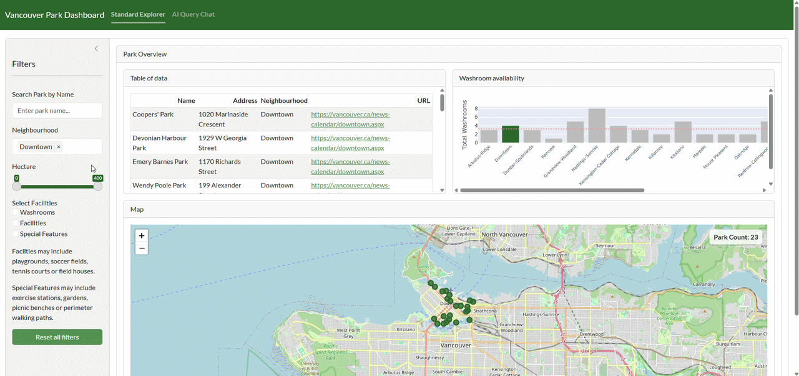

# Vancouver Parks Dashboard

## About

This project implements an interactive, public-facing dashboard showcasing all registered parks in Vancouver. The dashboard allows users to explore each park in detail, including its location, available amenities, and key features, such as size. Through intuitive visualizations and map-based navigation, users can easily examine the geographic distribution of parks across the city and dive deeper into the facilities that matter most to them. The goal is to make Vancouver’s park system more accessible, informative, and engaging for residents, visitors, and planners alike.

## For Users

### Motivation

Vancouver has many parks, but it can be hard to quickly compare locations, amenities, and park size in one place. This dashboard makes that information easy to browse and filter so residents, visitors, and planners can make faster, better decisions.

### What this dashboard solves

- Brings park location, neighbourhood, size, and amenity details into one interactive view.
- Makes it easy to filter parks by neighbourhood, size range, and available facilities.
- Helps users quickly discover suitable parks and understand park distribution across Vancouver.

### Live dashboard

- Deployed app (stable): [https://019c91e8-5952-d69b-140e-530221568f2d.share.connect.posit.cloud/](https://019c91e8-5952-d69b-140e-530221568f2d.share.connect.posit.cloud/)

- Preview app (testing): [https://019c91e9-b44b-69e7-46d2-7a59b8f8c10d.share.connect.posit.cloud/](https://019c91e9-b44b-69e7-46d2-7a59b8f8c10d.share.connect.posit.cloud/)

### Demo animation

#### 1. Demo of the first tab (main dashboard)


#### 2. Demo of the second tab (AI feature)


## Dataset Information

This dashboard visualizes the [City of Vancouver's Parks dataset](https://opendata.vancouver.ca/explore/dataset/parks/table/), which contains information on 218 parks throughout the City of Vancouver.

## For Contributors

### 1) Clone the repository

```bash
git clone <https://github.com/UBC-MDS/DSCI-532_2026_3_vancouver_park_dashboard.git>
cd DSCI-532_2026_3_vancouver_park_dashboard
```

### 2) Install dependencies

Option A (recommended): conda environment from `environment.yml`

```bash
conda env create -f environment.yml
conda activate park
```

Option B: pip from `requirements.txt`

```bash
python -m venv .venv
source .venv/bin/activate
pip install -r requirements.txt
```

### 3) Run the app locally

From the project root directory:

```bash
python -m shiny run --reload --launch-browser src/app.py
```

If your browser does not open automatically, visit:
`http://127.0.0.1:8000`

### 4) Run the tests

From the project root directory, run all dashboard tests with a single command:

```bash
pytest tests/unit/test_app.py
```

## Test Reflection

- `test_apply_dashboard_filters_combines_text_neighbourhood_and_facility_filters` checks that multiple dashboard filters are applied together as an intersection; if this changes, users could see parks that do not match all selected controls.
- `test_apply_dashboard_filters_uses_inclusive_hectare_boundaries` checks that parks exactly on the selected hectare limits are included; if this changes, the slider would behave inconsistently at boundary values.
- `test_best_match_neighbourhoods_returns_unique_fuzzy_matches` checks that fuzzy AI input still resolves to known neighbourhoods without duplicates; if this changes, AI queries could miss valid parks or apply the same neighbourhood repeatedly.
- `test_folium_map_skips_rows_without_coordinates` checks that the map omits parks with missing coordinates; if this changes, the map could render broken markers or invalid location data.

### Link to CONTRIBUTING.md

[https://github.com/UBC-MDS/DSCI-532_2026_3_vancouver_park_dashboard/blob/doc/CONTRIBUTING.md](https://github.com/UBC-MDS/DSCI-532_2026_3_vancouver_park_dashboard/blob/doc/CONTRIBUTING.md)
